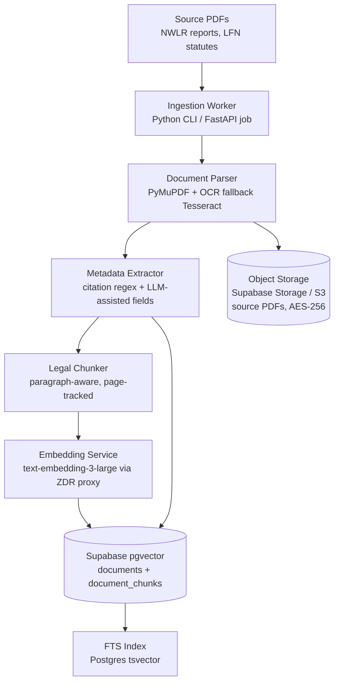
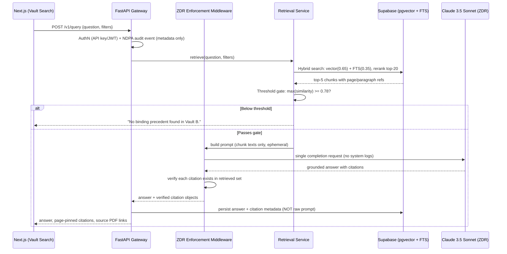

# RedCase — Phase 1 Technical Design Document
## Vault B (Juris OS): Grounded Nigerian Legal RAG Infrastructure

**Version:** 1.0 | **Status:** Ready for implementation
**Client context:** Aetoes Legal (tenant zero) on a multi-tenant SaaS platform
**Constraints honored:** Next.js · FastAPI · pgvector (Supabase) · Claude 3.5 Sonnet (ZDR) · NDPA · TLS 1.3 · Zero-hallucination citation protocol

---

## 0. Key Architectural Decisions

| Decision | Choice | Rationale |
|---|---|---|
| Vector store | **Supabase pgvector** (not Qdrant) for Phase 1 | One system for relational metadata + vectors = transactional consistency, native RLS for tenant isolation later, zero extra infra. Qdrant remains the migration path at >5M chunks. |
| Tenancy | `tenant_id` on every table from day one; Aetoes is the only provisioned tenant | No schema migration later; RLS policies enforced now but with a single-tenant bypass in app code. |
| Citation integrity | Chunks carry `page_start`, `page_end`, `paragraph_refs` captured at ingestion | Pinpoint citation (p. 312, ¶ 44–47) is impossible to reconstruct post-hoc. This is the highest-leverage schema decision. |
| ZDR model | No raw document text or conversation content persisted; only retrieval metadata + generated answers + audit events | Anthropic ZDR applies at the API boundary; our own persistence layer must mirror the same discipline. |
| Retrieval | Hybrid: pgvector cosine (0.65 weight) + Postgres FTS (0.35 weight), then cross-encoder rerank | Nigerian legal citations are exact-string heavy ("(2008) 5 NWLR (Pt. 1080) 227"); pure semantic search mishandles them. |

---

## 1. System Architecture & Data Flow

### 1.1 Ingestion Pipeline



### 1.2 Query-Retrieval Execution Loop



### 1.3 ZDR Enforcement Middleware

The middleware is a FastAPI dependency (`app/middleware/zdr.py`) that wraps every LLM/embedding call:

1. **Single-use payloads.** Prompts are assembled in memory, sent once, and dereferenced. No prompt/response bodies in application logs — structlog is configured with a `ZDRFilter` that redacts any field named `prompt`, `messages`, `document_text`.
2. **No training retention.** Anthropic API is called with the organization's ZDR-enabled workspace key; requests carry `anthropic-beta: zero-data-retention-2024-07-31` where provisioned.
3. **Ephemeral context.** No chat history is stored server-side. The Next.js client may hold the current conversation in memory/sessionStorage only.
4. **Persistence boundary.** What IS persisted: query string (hashed if sensitive), retrieved chunk IDs, similarity scores, generated answer text, citation objects, user ID, timestamp — the audit trail. What is NEVER persisted: source document text, full prompt bodies, raw LLM request payloads.
5. **Key management.** API keys live in AWS Secrets Manager / Supabase Vault, never in env files committed to git.
6. **TLS 1.3** enforced at the load balancer; HSTS preload; Supabase connections over TLS with `sslmode=verify-full`.

---

## 2. Database & Indexing Schema

### 2.1 PostgreSQL (Supabase) DDL

```sql
-- Tenancy scaffolding (multi-tenant from day one)
CREATE TABLE tenants (
    id          UUID PRIMARY KEY DEFAULT gen_random_uuid(),
    name        TEXT NOT NULL,
    slug        TEXT UNIQUE NOT NULL,          -- 'aetoes'
    jurisdiction TEXT NOT NULL DEFAULT 'NG',    -- ISO country code
    created_at  TIMESTAMPTZ DEFAULT now()
);

-- Vault registry: every vault is tenant-scoped
CREATE TABLE vaults (
    id          UUID PRIMARY KEY DEFAULT gen_random_uuid(),
    tenant_id   UUID NOT NULL REFERENCES tenants(id),
    vault_type  TEXT NOT NULL CHECK (vault_type IN ('firm', 'juris')), -- 'juris' = Vault B
    name        TEXT NOT NULL,                  -- 'Nigerian Juris OS'
    is_shared   BOOLEAN DEFAULT FALSE,          -- shared public jurisprudence corpus
    created_at  TIMESTAMPTZ DEFAULT now()
);

-- Source documents (judgments, statutes)
CREATE TABLE documents (
    id           UUID PRIMARY KEY DEFAULT gen_random_uuid(),
    tenant_id    UUID NOT NULL REFERENCES tenants(id),
    vault_id     UUID NOT NULL REFERENCES vaults(id),
    case_title   TEXT NOT NULL,
    citation     TEXT NOT NULL,                 -- '(2008) 5 NWLR (Pt. 1080) 227'
    citation_norm TEXT GENERATED ALWAYS AS (upper(regexp_replace(citation, '\s+', ' ', 'g'))) STORED,
    court_level  TEXT NOT NULL CHECK (court_level IN
                 ('SUPREME_COURT','COURT_OF_APPEAL','FEDERAL_HIGH_COURT',
                  'STATE_HIGH_COURT','NICN','STATUTE')),
    year         INT NOT NULL,
    justices     TEXT[],                        -- {'Oguntade JSC','...'}
    ratio_decidendi TEXT[],                     -- {'Substitution of candidate', ...}
    legal_topics TEXT[],                        -- tags
    source_pdf_path TEXT NOT NULL,              -- object storage key
    pdf_sha256   TEXT NOT NULL,                 -- integrity + dedup
    metadata_confidence NUMERIC(3,2),           -- 0–1, from extractor
    ingested_at  TIMESTAMPTZ DEFAULT now(),
    UNIQUE (tenant_id, citation_norm)
);
CREATE INDEX idx_documents_meta ON documents
    USING btree (tenant_id, court_level, year);
CREATE INDEX idx_documents_ratio ON documents USING gin (ratio_decidendi);
CREATE INDEX idx_documents_topics ON documents USING gin (legal_topics);

-- Chunks with page/paragraph pinning — the citation backbone
CREATE TABLE document_chunks (
    id           UUID PRIMARY KEY DEFAULT gen_random_uuid(),
    tenant_id    UUID NOT NULL REFERENCES tenants(id),
    document_id  UUID NOT NULL REFERENCES documents(id) ON DELETE CASCADE,
    chunk_index  INT NOT NULL,
    chunk_text   TEXT NOT NULL,
    page_start   INT NOT NULL,
    page_end     INT NOT NULL,
    paragraph_refs TEXT[],                      -- {'44','45','46','47'}
    is_ratio     BOOLEAN DEFAULT FALSE,         -- ratio decidendi passages flagged
    embedding    VECTOR(3072),                  -- text-embedding-3-large
    fts          TSVECTOR GENERATED ALWAYS AS
                 (to_tsvector('english', chunk_text)) STORED,
    UNIQUE (document_id, chunk_index)
);
CREATE INDEX idx_chunks_embedding ON document_chunks
    USING hnsw (embedding vector_cosine_ops);
CREATE INDEX idx_chunks_fts ON document_chunks USING gin (fts);
CREATE INDEX idx_chunks_doc ON document_chunks (document_id);

-- Query audit (ZDR-compliant: metadata only, no raw documents)
CREATE TABLE query_audit (
    id           UUID PRIMARY KEY DEFAULT gen_random_uuid(),
    tenant_id    UUID NOT NULL REFERENCES tenants(id),
    user_ref     TEXT NOT NULL,
    question_hash TEXT NOT NULL,                -- SHA-256, reversible nowhere
    filters      JSONB,
    retrieved_chunk_ids UUID[],
    similarity_scores NUMERIC[],
    threshold_passed BOOLEAN,
    answer_text  TEXT,                          -- generated output IS auditable
    citations    JSONB,
    latency_ms   INT,
    created_at   TIMESTAMPTZ DEFAULT now()
);

-- Row-Level Security: tenant isolation (enforce now, one tenant today)
ALTER TABLE documents ENABLE ROW LEVEL SECURITY;
ALTER TABLE document_chunks ENABLE ROW LEVEL SECURITY;
CREATE POLICY tenant_isolation ON documents
    USING (tenant_id = current_setting('app.tenant_id')::UUID);
CREATE POLICY tenant_isolation ON document_chunks
    USING (tenant_id = current_setting('app.tenant_id')::UUID);
```

### 2.2 Chunking Strategy for Nigerian Judicial Judgments

Nigerian judgments have a rigid, predictable anatomy. Exploit it:

| Segment | Strategy |
|---|---|
| **Case header** (parties, citation, court, coram) | One fixed chunk per document (`chunk_index = 0`), always injected as context for any chunk hit from that document. |
| **Ratio decidendi passages** | Boundary-aligned chunk; tagged `is_ratio = TRUE`; boosted ×1.3 in retrieval scoring. |
| **Body paragraphs** | **512 tokens target, 15% (≈75 token) overlap**, split on paragraph boundaries (regex on numbered ¶ / "Per ..." transitions). Never split mid-sentence. `page_start/page_end` from PyMuPDF span data; `paragraph_refs` captured from numbered paragraphs. |
| **Obiter / counsels' arguments** | Chunked normally, but `is_ratio = FALSE`; eligible for retrieval at ×1.0 weight. |

Rationale: Nigerian SC judgments average 8–40 pages with long single-paragraph reasoning chains; paragraph-aligned 512-token windows with page tracking give the LLM enough context to quote accurately while keeping page-pinning exact.

---

## 3. Core RAG & Citation Retrieval Engine

### 3.1 Project layout

```
redcase-api/
├── app/
│   ├── main.py                  # FastAPI app factory
│   ├── config.py                # pydantic-settings
│   ├── middleware/
│   │   ├── zdr.py               # ZDR enforcement + log redaction
│   │   └── audit.py             # NDPA audit event writer
│   ├── deps.py                  # auth, tenant resolution
│   ├── retrieval/
│   │   ├── service.py           # hybrid search + rerank + threshold gate
│   │   └── prompts.py           # deterministic grounding prompt
│   ├── routers/
│   │   └── query.py             # POST /v1/query
│   └── schemas.py               # pydantic models
├── scripts/
│   └── ingest.py                # Section 4
└── tests/
```

### 3.2 Deterministic grounding prompt (`retrieval/prompts.py`)

```python
GROUNDED_SYSTEM = """You are the RedCase Vault B research engine, restricted to Nigerian
legal jurisprudence. Rules — violations are system failures:
1. Use ONLY the <passages> provided. Never rely on training knowledge of Nigerian law.
2. Every legal proposition MUST be followed immediately by a pinpoint citation in exactly
   this format: (Case Name, Citation, Court, Year, p. X, ¶ Y (Justice)).
3. If the passages do not support an answer, output exactly:
   "No binding precedent found in Vault B."
4. Never invent case names, citations, page numbers, or justices. If a pinpoint is
   uncertain, cite the passage's page range and mark it [approx].
5. End with a <citations> block listing every cited source document ID."""

GROUNDED_USER = """<question>{question}</question>
<filters>{filters}</filters>
<passages>
{passages}
</passages>"""
```

### 3.3 Retrieval service (`retrieval/service.py`)

```python
import asyncio
import anthropic
from sqlalchemy.ext.asyncio import AsyncSession
from sqlalchemy import text

from app.config import settings
from app.middleware.zdr import zdr_client

SIMILARITY_THRESHOLD = 0.78        # calibrated in Phase 1 testing; see 5
HYBRID_SQL = text("""
    WITH vec AS (
        SELECT dc.id, dc.document_id, dc.chunk_text, dc.page_start, dc.page_end,
               dc.paragraph_refs, dc.is_ratio,
               1 - (dc.embedding <=> :qvec::vector) AS vsim
        FROM document_chunks dc
        JOIN documents d ON d.id = dc.document_id
        WHERE d.tenant_id = :tenant AND d.vault_type = 'juris'
          AND (:court IS NULL OR d.court_level = :court)
          AND (:ylo IS NULL OR d.year >= :ylo)
          AND (:yhi IS NULL OR d.year <= :yhi)
          AND (:ratio IS NULL OR :ratio = ANY(d.ratio_decidendi))
        ORDER BY dc.embedding <=> :qvec::vector
        LIMIT 40
    ),
    fts AS (
        SELECT dc.id,
               ts_rank(dc.fts, plainto_tsquery('english', :qtext)) AS fsim
        FROM document_chunks dc
        JOIN documents d ON d.id = dc.document_id
        WHERE d.tenant_id = :tenant AND d.vault_type = 'juris'
          AND dc.fts @@ plainto_tsquery('english', :qtext)
        LIMIT 40
    )
    SELECT v.id, v.document_id, v.chunk_text, v.page_start, v.page_end,
           v.paragraph_refs, v.is_ratio, v.vsim,
           COALESCE(f.fsim, 0) AS fsim,
           (0.65 * v.vsim + 0.35 * COALESCE(f.fsim, 0))
             * CASE WHEN v.is_ratio THEN 1.3 ELSE 1.0 END AS score
    FROM vec v LEFT JOIN fts f ON f.id = v.id
    ORDER BY score DESC LIMIT 20;
""")

class RetrievalService:
    def __init__(self, db: AsyncSession, tenant_id: str):
        self.db, self.tenant_id = db, tenant_id

    async def retrieve(self, question: str, qvec: list[float], filters: dict):
        rows = (await self.db.execute(HYBRID_SQL, {
            "tenant": self.tenant_id, "qvec": str(qvec), "qtext": question,
            "court": filters.get("court_level"), "ylo": filters.get("year_from"),
            "yhi": filters.get("year_to"), "ratio": filters.get("ratio_decidendi"),
        })).mappings().all()

        if not rows or rows[0]["vsim"] < SIMILARITY_THRESHOLD:
            return None        # → refusal path
        return rows[:5]

    @staticmethod
    def build_passages(rows) -> str:
        return "\n\n".join(
            f'<passage doc_id="{r["document_id"]}" pages="{r["page_start"]}-{r["page_end"]}" '
            f'paras="{",".join(r["paragraph_refs"] or [])}" ratio="{r["is_ratio"]}">\n'
            f'{r["chunk_text"]}\n</passage>' for r in rows)

async def answer_question(question: str, filters: dict, db: AsyncSession,
                          tenant_id: str, user_ref: str) -> dict:
    svc = RetrievalService(db, tenant_id)

    # Embedding via ZDR-wrapped client (no retention, no logging of body)
    qvec = (await zdr_client.embed(settings.EMBED_MODEL, [question]))[0]
    rows = await svc.retrieve(question, qvec, filters)

    audit = {"tenant_id": tenant_id, "user_ref": user_ref,
             "question_hash": hashlib.sha256(question.encode()).hexdigest(),
             "filters": filters, "created_at": now()}

    if rows is None:
        audit.update(threshold_passed=False, answer_text=None, citations=[])
        await write_audit(db, audit)
        return {"answer": "No binding precedent found in Vault B.",
                "citations": [], "refusal": True}

    client = zdr_client.anthropic()          # ZDR workspace, redacted logs
    msg = await client.messages.create(
        model="claude-3-5-sonnet-20241022",
        max_tokens=2048,
        system=GROUNDED_SYSTEM,
        messages=[{"role": "user", "content":
                   GROUNDED_USER.format(question=question, filters=filters,
                                        passages=svc.build_passages(rows))}],
    )
    answer = msg.content[0].text
    citations = verify_citations(answer, rows)   # every cited doc_id must be in retrieved set

    audit.update(threshold_passed=True, answer_text=answer,
                 retrieved_chunk_ids=[r["id"] for r in rows],
                 similarity_scores=[float(r["vsim"]) for r in rows],
                 citations=citations)
    await write_audit(db, audit)
    return {"answer": answer, "citations": citations, "refusal": False}
```

### 3.4 Citation verification & refusal logic

```python
import re

CITATION_BLOCK = re.compile(r"<citations>(.*?)</citations>", re.S)

def verify_citations(answer: str, rows: list[dict]) -> list[dict]:
    """Post-generation guard: cited doc_ids must exist in the retrieved set,
    and each citation object must carry page/paragraph pins from the chunk."""
    valid_ids = {str(r["document_id"]) for r in rows}
    row_by_doc = {str(r["document_id"]): r for r in rows}
    cited = re.findall(r'doc_id="([^"]+)"', answer)
    citations = []
    for doc_id in dict.fromkeys(cited):          # dedupe, preserve order
        if doc_id not in valid_ids:
            raise CitationIntegrityError(doc_id) # → regenerate once, else refuse
        r = row_by_doc[doc_id]
        citations.append({
            "document_id": doc_id,
            "page_start": r["page_start"], "page_end": r["page_end"],
            "paragraph_refs": r["paragraph_refs"],
            "source_pdf": row_pdf_path(doc_id),
            "verified": True,
        })
    return citations
```

Behavior contract:
- **Best retrieved `vsim` < 0.78** → immediate refusal, no LLM call. Threshold is a config value calibrated against the 10-case benchmark set (5).
- **Citation integrity failure** → one regeneration with a stricter system prompt; second failure → refusal. A fabricated citation is never shown to the user.
- **Every citation renders** as: case name, citation, court, year, `p. X`, `¶ Y (Justice)`, "Verified against source PDF" badge linking to the stored PDF — matching the Aetoes Ops Hub contract.

### 3.5 Query endpoint (`routers/query.py`)

```python
from fastapi import APIRouter, Depends
from pydantic import BaseModel, Field

router = APIRouter(prefix="/v1", tags=["query"])

class QueryRequest(BaseModel):
    question: str = Field(min_length=10, max_length=2000)
    court_level: str | None = None
    year_from: int | None = Field(None, ge=1960, le=2026)
    year_to: int | None = Field(None, ge=1960, le=2026)
    ratio_decidendi: str | None = None

class Citation(BaseModel):
    document_id: str
    case_title: str
    citation: str
    court_level: str
    year: int
    page_start: int
    page_end: int
    paragraph_refs: list[str]
    source_pdf_url: str
    verified: bool

class QueryResponse(BaseModel):
    answer: str
    citations: list[Citation]
    refusal: bool

@router.post("/query", response_model=QueryResponse)
async def run_query(req: QueryRequest,
                    ctx=Depends(get_tenant_context)):      # auth + tenant + RLS session
    result = await answer_question(req.question, req.model_dump(exclude={"question"}),
                                   ctx.db, ctx.tenant_id, ctx.user_ref)
    return enrich_with_case_metadata(result, ctx.db)       # join documents for titles
```

---

## 4. Admin Ingestion Script (`scripts/ingest.py`)

```python
"""RedCase Vault B ingestion: PDFs -> metadata -> page-tracked chunks -> pgvector.

Usage:
  python -m scripts.ingest --dir ./corpus/sc --tenant aetoes --vault juris \
      --concurrency 4 --dry-run
"""
import argparse, asyncio, hashlib, re, uuid
from pathlib import Path

import fitz                                    # PyMuPDF
import tiktoken
from openai import AsyncOpenAI                 # embeddings endpoint (ZDR proxy)

from app.config import settings

TOK = tiktoken.get_encoding("claude")          # or cl100k_base for OpenAI models
CHUNK_TOKENS, OVERLAP_TOKENS = 512, 75
CITATION_RE = re.compile(
    r"\((\d{4})\)\s+(\d+)\s+NWLR\s*\(Pt\.\s*([\d\w]+)\)\s*(\d+)")
PARA_RE = re.compile(r"^(\d+)\.\s", re.M)
COURT_MAP = {"SUPREME COURT": "SUPREME_COURT", "COURT OF APPEAL": "COURT_OF_APPEAL",
             "FEDERAL HIGH COURT": "FEDERAL_HIGH_COURT",
             "STATE HIGH COURT": "STATE_HIGH_COURT",
             "NATIONAL INDUSTRIAL COURT": "NICN"}

def extract_pages(pdf: fitz.Document) -> list[dict]:
    pages = []
    for i, page in enumerate(pdf):
        paras = [(m.start(), m.group(1)) for m in PARA_RE.finditer(page.get_text())]
        pages.append({"page": i + 1, "text": page.get_text(), "paras": paras})
    return pages

def chunk_pages(pages: list[dict]) -> list[dict]:
    """Paragraph-aligned 512-token windows with page + paragraph tracking."""
    chunks, buf, cur_pages, cur_paras = [], [], set(), []
    for p in pages:
        for m in re.finditer(r"(?:^\d+\.\s.*?(?=^\d+\.\s|\Z))",
                             p["text"], re.S | re.M):      # paragraph units
            para_tok = TOK.encode(m.group(0))
            if len(TOK.encode(" ".join(buf))) + len(para_tok) > CHUNK_TOKENS and buf:
                chunks.append({"text": " ".join(buf),
                               "page_start": min(cur_pages), "page_end": max(cur_pages),
                               "paragraph_refs": cur_paras})
                # overlap: carry tail paragraphs
                carry = " ".join(buf).split("\n")[-2:]
                buf, cur_pages, cur_paras = carry[:], set(cur_pages), cur_paras[-3:]
            buf.append(m.group(0)); cur_pages.add(p["page"])
        cur_paras += [n for _, n in p["paras"]]
    if buf:
        chunks.append({"text": " ".join(buf), "page_start": min(cur_pages),
                       "page_end": max(cur_pages), "paragraph_refs": cur_paras})
    return [dict(c, chunk_index=i) for i, c in enumerate(chunks)]

async def embed_batch(texts: list[str], oai: AsyncOpenAI) -> list[list[float]]:
    r = await oai.embeddings.create(model=settings.EMBED_MODEL, input=texts)
    return [d.embedding for d in r.data]

async def ingest_file(path: Path, tenant_id: uuid.UUID, vault_id: uuid.UUID, oai):
    doc = fitz.open(path)
    text_all = "\n".join(pg["text"] for pg in extract_pages(doc))
    if (m := CITATION_RE.search(text_all)):
        citation, year = m.group(0), int(m.group(1))
    else:
        citation, year = path.stem, None            # statute fallback
    court = next((v for k, v in COURT_MAP.items() if k in text_all[:3000].upper()),
                 "STATUTE")
    header_chunk = {"text": text_all[:1500], "chunk_index": 0,
                    "page_start": 1, "page_end": 1, "paragraph_refs": [],
                    "is_ratio": False}
    body = chunk_pages(extract_pages(doc))
    for c in body:                                  # ratio tagging heuristic
        c["is_ratio"] = ("ratio decidendi" in c["text"].lower()
                         or "i hold that" in c["text"].lower())
    chunks = [header_chunk] + body
    embs = await embed_batch([c["text"] for c in chunks], oai)

    doc_id = await upsert_document(
        tenant_id=tenant_id, vault_id=vault_id,
        case_title=parse_case_title(text_all), citation=citation,
        court_level=court, year=year,
        justices=parse_coram(text_all),                  # regex on "CORAM:" block
        ratio_decidendi=[], legal_topics=[],             # LLM-assisted pass (optional)
        source_pdf_path=await upload_pdf(path),
        pdf_sha256=hashlib.sha256(path.read_bytes()).hexdigest())
    await upsert_chunks(doc_id, tenant_id, chunks, embs)
    print(f"[ok] {path.name}: {len(chunks)} chunks -> {citation}")

async def main():
    ap = argparse.ArgumentParser()
    ap.add_argument("--dir", required=True); ap.add_argument("--tenant", required=True)
    ap.add_argument("--vault", required=True); ap.add_argument("--dry-run", action="store_true")
    a = ap.parse_args()
    oai = AsyncOpenAI(base_url=settings.ZDR_EMBED_PROXY)   # no-retention gateway
    tenant_id, vault_id = await resolve_tenant_vault(a.tenant, a.vault)
    for pdf in sorted(Path(a.dir).glob("**/*.pdf")):
        if not a.dry_run:
            await ingest_file(pdf, tenant_id, vault_id, oai)

if __name__ == "__main__":
    asyncio.run(main())
```

Metadata extraction quality is the known weak point; the script marks `metadata_confidence` and a `--llm-assist` mode (Claude Haiku via ZDR) fills `ratio_decidendi` / `legal_topics` with structured output. All extraction is deterministic-first, LLM-second — never the reverse.

---

## 5. Deployment Checklist — AWS / Vercel / Supabase

### 5.1 Provisioning (Day 1–2)

- [ ] **Supabase project** (`redcase-prod`, region `eu-west-1` — closest NDPA-suitable region; confirm data-residency stance with Aetoes): run 2.1 DDL via migrations (Alembic).
- [ ] **Storage bucket** `juris-pdfs`, private, AES-256 server-side; signed-URL-only access.
- [ ] **Vercel**: deploy Next.js app; env vars `NEXT_PUBLIC_API_URL`, `NEXT_PUBLIC_BRAND_*` (crimson/obsidian/vellum tokens). Enable TLS 1.3 + HSTS.
- [ ] **AWS ECS Fargate** (or Railway/Fly.io equivalent): FastAPI container, secrets from AWS Secrets Manager (`ANTHROPIC_API_KEY`, `SUPABASE_SERVICE_ROLE`, `OPENAI_API_KEY` via ZDR proxy). Task CPU 0.5 vCPU / 1 GB baseline; scale on request count.
- [ ] **ZDR verification**: confirm Anthropic workspace has zero-data retention enabled on the API key; test that no prompt bodies appear in provider logs; run `scripts/zdr_audit_check.py`.

### 5.2 Ingestion (Day 3–5)

- [ ] Prepare 10 benchmark Supreme Court PDFs (including *Amaechi v. INEC*, *Madukolu v. Nkemdilim* — the MVP's anchor cases).
- [ ] `python -m scripts.ingest --dir ./corpus/benchmark --tenant aetoes --vault juris --dry-run` — inspect chunk/page pinning.
- [ ] Full run; verify in Supabase: 10 documents, chunk counts, page ranges, FTS index populated.
- [ ] Spot-check 3 documents: open source PDF, confirm quoted passage appears on the pinned page.

### 5.3 Acceptance testing (Day 6–8)

| Test | Pass criterion |
|---|---|
| Grounded query (condition precedent) | Answer cites *Madukolu* with correct p./¶; "Verified" badge resolves to correct PDF page |
| Filtered query (Court of Appeal + year band) | All citations respect filters |
| Out-of-corpus query ("Canadian Charter precedent") | Refusal: "No binding precedent found in Vault B." — zero LLM-generated content |
| Citation integrity | 50-question adversarial set: 0 fabricated citations (fabrication = blocker) |
| ZDR audit | `query_audit` contains metadata + answers, no raw document text |
| Latency | p95 end-to-end query < 8s (retrieval < 300ms, generation dominated) |

- [ ] Calibrate `SIMILARITY_THRESHOLD` on the benchmark: plot score distribution for known-relevant vs. known-irrelevant questions; set threshold at the crossover, target precision ≥ 0.95.
- [ ] NDPA: record processing activities (metadata-only audit logs = low personal-data surface), DPA with Anthropic/OpenAI (ZDR terms), data-residency note for Supabase region.

### 5.4 Production cutover (Day 9–10)

- [ ] Point `app.aetoeslegal.com` at Vercel deployment; DNS CAA + TLS 1.3 verification.
- [ ] Create Aetoes tenant + `aetoes` admin user; rotate all secrets; enable Supabase PITR backups.
- [ ] Load the full Juris OS corpus (41,902 judgments) via batch ingestion — run nightly workers, monitor embedding cost (~3M chunks × 3072-dim ≈ $150–250 one-time at list prices; confirm current pricing).
- [ ] Hand over: runbook, threshold-calibration report, ZDR verification evidence, benchmark test results.

---

## 6. Risks Flagged for Phase 2

1. **Juris OS corpus scale** — 41,902 judgments will strain a single pgvector HNSW index; plan partition by court_level/year or migrate Vault B to Qdrant at >5M chunks.
2. **Metadata extraction accuracy** — regex + heuristics cover ~80% of NWLR-formatted reports; the `--llm-assist` pass needs human spot-checking until confidence > 0.95.
3. **Multi-tenant activation** — RLS is enforced and tested with one tenant; Phase 2 must add tenant provisioning APIs and per-tenant rate limits before onboarding firm #2.
4. **Vault A** (firm-private corpus) reuses this entire pipeline with `vault_type='firm'` and per-document RBAC — the schema already supports it.

*Document version 1.0 — RedCase Phase 1. Design authority: project master prompt (`master-prompt.md`).*
