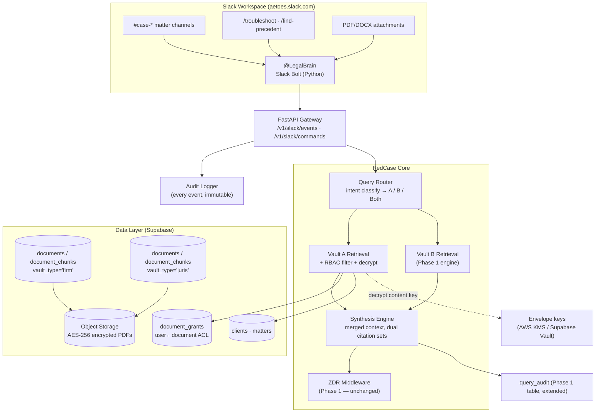

# RedCase — Phase 2 Technical Design Document
## Vault A (Firm Brain) · Dual-Vault Query Router · Slack Operations Hub

**Version:** 1.0 | **Status:** Ready for implementation
**Builds on:** Phase 1 (`RedCase-Phase1-Design.md`) — Vault B, FastAPI RAG core, ZDR middleware
**Brand assets:** `/brand` — RedCase SVG set (SVGO optimization required pre-production; see §6)

---

## 0. What Changes in Phase 2

Phase 1 established the public jurisprudence corpus (Vault B) and the grounded-retrieval engine. Phase 2 adds three things, in order of risk:

1. **Vault A** — the firm's confidential brain. Same pipeline as Phase 1, plus: AES-256-GCM field-level encryption, document-level RBAC (partner-restricted files must not surface to unauthorized staff), `client_id`/`matter_id` scoping, and classification levels.
2. **Dual-vault query router** — an intent classifier that routes each query to Vault A, Vault B, or both, then synthesizes with separate citation namespaces. This is the "Cross-Vault Synthesis" the pitch deck promises.
3. **Slack Ops Hub** — `@LegalBrain` bot: matter-channel intake, slash commands, threaded execution. Slack becomes a client; the platform stays the system of record.

The non-negotiable from the pitch deck that shapes everything: **client privilege isolation**. A restricted partner's brief must be invisible — not just unanswerable — to everyone without an explicit grant.

---

## 1. Multi-Vault Architecture & Security Flow

### 1.1 Logical Architecture



### 1.2 Vault A Schema (migration on top of Phase 1)

Phase 1's `documents` table already supports Vault A via `vault_type='firm'`. Phase 2 adds:

```sql
-- Clients & matters (firm-side scoping entities)
CREATE TABLE clients (
    id          UUID PRIMARY KEY DEFAULT gen_random_uuid(),
    tenant_id   UUID NOT NULL REFERENCES tenants(id),
    name        TEXT NOT NULL,
    contact_ref JSONB,                        -- email, phone; encrypt sensitive fields
    created_at  TIMESTAMPTZ DEFAULT now()
);

CREATE TABLE matters (
    id           UUID PRIMARY KEY DEFAULT gen_random_uuid(),
    tenant_id    UUID NOT NULL REFERENCES tenants(id),
    client_id    UUID NOT NULL REFERENCES clients(id),
    matter_ref   TEXT NOT NULL,               -- 'FBN v. Aetoes'
    status       TEXT NOT NULL DEFAULT 'ACTIVE'
                 CHECK (status IN ('ACTIVE','CONCLUDED','ARCHIVED')),
    slack_channel TEXT UNIQUE,                -- '#case-fbn-v-aetoes' ↔ matter binding
    opened_at    TIMESTAMPTZ DEFAULT now(),
    UNIQUE (tenant_id, matter_ref)
);

-- Vault A metadata extensions (columns added to documents)
ALTER TABLE documents ADD COLUMN client_id      UUID REFERENCES clients(id);
ALTER TABLE documents ADD COLUMN matter_id      UUID REFERENCES matters(id);
ALTER TABLE documents ADD COLUMN classification_level TEXT NOT NULL DEFAULT 'FIRM_INTERNAL'
    CHECK (classification_level IN
           ('PUBLIC','FIRM_INTERNAL','CONFIDENTIAL','PARTNER_RESTRICTED'));
ALTER TABLE documents ADD COLUMN encrypted_content_hash TEXT;  -- HMAC-SHA256 of ciphertext
ALTER TABLE documents ADD COLUMN dek_wrapped    BYTEA;         -- envelope-encrypted data key
ALTER TABLE documents ADD COLUMN doc_type       TEXT
    CHECK (doc_type IN ('BRIEF','PLEADING','OPINION','CONTRACT','CORRESPONDENCE','OTHER'));

-- Document-level ACL: the privilege-isolation backbone
CREATE TABLE document_grants (
    id          UUID PRIMARY KEY DEFAULT gen_random_uuid(),
    tenant_id   UUID NOT NULL REFERENCES tenants(id),
    document_id UUID NOT NULL REFERENCES documents(id) ON DELETE CASCADE,
    user_ref    TEXT NOT NULL,                -- Slack/IdP user ID
    grant_level TEXT NOT NULL DEFAULT 'READ'
                CHECK (grant_level IN ('READ','ANNOTATE','ADMIN')),
    granted_by  TEXT NOT NULL,
    granted_at  TIMESTAMPTZ DEFAULT now(),
    UNIQUE (document_id, user_ref)
);

-- Slack binding & intake tracking
CREATE TABLE slack_intake (
    id          UUID PRIMARY KEY DEFAULT gen_random_uuid(),
    tenant_id   UUID NOT NULL REFERENCES tenants(id),
    slack_event_id TEXT UNIQUE NOT NULL,      -- idempotency key
    channel_id  TEXT NOT NULL,
    matter_id   UUID REFERENCES matters(id),
    user_ref    TEXT NOT NULL,
    attachment_hash TEXT,
    document_id UUID REFERENCES documents(id),
    action      TEXT NOT NULL,                -- 'MENTION','SLASH','INTAKE'
    created_at  TIMESTAMPTZ DEFAULT now()
);
```

RLS — Phase 1's tenant isolation stays; Phase 2 adds the **privilege layer**:

```sql
-- Base: documents visible if classification <= what the user can see,
-- enforced via app-set GUC 'app.user_clearance' (PARTNER > SENIOR > STAFF)
CREATE POLICY vault_a_clearance ON documents
    USING (vault_type <> 'firm'
        OR classification_level = 'FIRM_INTERNAL'
        OR current_setting('app.user_clearance') IN ('PARTNER','ADMIN')
        OR EXISTS (SELECT 1 FROM document_grants g
                   WHERE g.document_id = id AND g.user_ref = current_setting('app.user_ref')));

-- Retrieval-time grant filter (applied in SQL, not app code, so it cannot be skipped)
CREATE POLICY chunk_privilege ON document_chunks
    USING (vault_type_guard());   -- joins documents, applies same clearance + grant rules
```

**Encryption model.** Two layers, deliberately:
- **Storage layer** — Supabase Storage/S3 SSE-AES-256 for PDF blobs (same as Phase 1). This satisfies "encrypted at rest" for the platform.
- **Envelope layer** (the differentiator) — each Vault A document gets a unique 256-bit DEK, wrapped by a tenant master key in AWS KMS. Chunk text for `classification_level >= 'CONFIDENTIAL'` is AES-256-GCM encrypted at the application layer before upsert; only retrieval workers holding the unwrapped DEK can embed or serve it. `encrypted_content_hash` (HMAC over ciphertext) gives tamper evidence for the audit trail.

---

## 2. Query Router & Dual-Vault RAG Engine

### 2.1 Routing design

A single LLM call classifies intent before retrieval. Cheap (Haiku), fast, and — critically — the classifier **only sees the question, never document content**, so it adds no privilege surface.

Route contract:

| Signal | Route | Example |
|---|---|---|
| Firm practice, style, internal strategy, past matters | **A** | "How do we usually structure a preliminary objection?" |
| Public law, precedent, statutes | **B** | "Leading SC case on garnishee proceedings?" |
| Drafting anchored in both internal precedent and public law | **A+B** | "Draft a motion to strike out based on our win in Case X and binding precedent" |

### 2.2 Router + synthesis implementation

```python
# app/router/service.py
import json
from enum import Enum

from anthropic import AsyncAnthropic
from sqlalchemy.ext.asyncio import AsyncSession

from app.config import settings
from app.middleware.zdr import zdr_client
from app.retrieval.service import answer_question, RetrievalService   # Phase 1

class Route(str, Enum):
    VAULT_A = "A"
    VAULT_B = "B"
    BOTH    = "BOTH"

ROUTER_SYSTEM = """Classify the legal query into exactly one route.
A = firm-internal knowledge (our past briefs, strategy, templates, matters).
B = public Nigerian law (statutes, case precedent) — the answer exists in public sources.
BOTH = drafting/synthesis that needs our internal approach AND public authority.
Reply with JSON only: {"route": "A"|"B"|"BOTH", "confidence": 0.0-1.0,
"rewritten_queries": {"a": "...", "b": "..."}}  — rewrite per-vault queries for
best retrieval. If confidence < 0.6, use route B."""

async def classify(question: str) -> dict:
    client: AsyncAnthropic = zdr_client.anthropic()
    msg = await client.messages.create(
        model="claude-3-5-haiku-20241022", max_tokens=300,
        system=ROUTER_SYSTEM,
        messages=[{"role": "user", "content": question}])
    try:
        return json.loads(extract_json(msg.content[0].text))
    except json.JSONDecodeError:
        return {"route": "B", "confidence": 0.0, "rewritten_queries": {"b": question}}

SYNTH_SYSTEM = """You are RedCase cross-vault synthesis. Two citation namespaces:
<internal> passages = Vault A firm documents (cite: [A:doc_id, p.X]).
<public> passages = Vault B jurisprudence (cite: [B:doc_id, citation, p.X, ¶Y (Justice)]).
Rules:
1. Internal strategy informs STRUCTURE and ARGUMENT; public authority provides LEGAL GROUNDING. Never present internal position as public law or vice versa.
2. Every proposition carries a namespace-tagged citation. No namespace mixing.
3. Unsupported by either namespace → "No binding support found."
4. End with <citations> listing both sets separately."""

async def dual_vault_query(question: str, ctx, db: AsyncSession) -> dict:
    """ctx: TenantContext(user_ref, tenant_id, clearance, matter_id?)"""
    plan = await classify(question)
    audit_extra = {"route": plan["route"], "route_confidence": plan["confidence"]}

    match Route(plan["route"]):
        case Route.VAULT_B:
            return await answer_question(plan["rewritten_queries"]["b"],
                                         filters={}, db=db, tenant_id=ctx.tenant_id,
                                         user_ref=ctx.user_ref, vault="juris",
                                         audit_extra=audit_extra)

        case Route.VAULT_A:
            return await vault_a_query(plan["rewritten_queries"]["a"], ctx, db, audit_extra)

        case Route.BOTH:
            # Parallel retrieval — RLS + grants enforced inside each service
            internal, public = await asyncio.gather(
                vault_a_query(plan["rewritten_queries"]["a"], ctx, db, audit_extra,
                              dry_run=True),
                answer_question(plan["rewritten_queries"]["b"], {}, db,
                                ctx.tenant_id, ctx.user_ref, vault="juris",
                                audit_extra=audit_extra, dry_run=True))
            return await synthesize(question, internal, public, ctx, db)

async def vault_a_query(q: str, ctx, db: AsyncSession, audit_extra: dict,
                        dry_run: bool = False) -> dict:
    """Vault A retrieval = Phase 1 engine + privilege filter + decryption.
    The clearance + document_grants join happens IN SQL (§1.2 policy)."""
    svc = RetrievalService(db, ctx.tenant_id, user_ref=ctx.user_ref,
                           clearance=ctx.clearance, vault="firm")
    rows = await svc.retrieve(q, filters={"matter_id": ctx.matter_id} if ctx.matter_id else {})
    if not rows:
        return {"passages": [], "citations": []}
    passages = decrypt_rows(rows)          # unwrap DEK via KMS, AES-256-GCM decrypt
    if dry_run:
        return {"passages": passages, "citations": []}
    return await generate_with(SYNTH_SYSTEM, passages, ctx, db, audit_extra)

async def synthesize(question, internal, public, ctx, db):
    if not internal["passages"] and not public.get("passages"):
        return {"answer": "No binding support found.", "citations": [], "refusal": True}
    user = (f"<question>{question}</question>\n"
            f"<internal>{format_passages(internal['passages'])}</internal>\n"
            f"<public>{format_passages(public['passages'])}</public>")
    client = zdr_client.anthropic()
    msg = await client.messages.create(model="claude-3-5-sonnet-20241022",
                                       max_tokens=2048, system=SYNTH_SYSTEM,
                                       messages=[{"role": "user", "content": user}])
    answer = msg.content[0].text
    verify_dual_citations(answer, internal["passages"], public["passages"])
    return {"answer": answer, "citations": split_citations(answer),
            "refusal": False}
```

Key engineering decisions:

- **RLS is enforced in SQL, not in Python.** `RetrievalService.retrieve()` for Vault A always executes with `app.user_ref` and `app.user_clearance` set on its connection (per-request, via `SET LOCAL`). A code path that forgets the filter cannot exist, because the filter is the policy.
- **Route-A + matter binding:** when the query arrives from a matter channel (`ctx.matter_id` set), retrieval is pre-filtered to that matter unless the user is a partner with cross-matter clearance — matching how firms actually compartmentalize.
- **Refusal semantics preserved:** Vault A miss + Vault B miss → refusal, never a guess. Vault A hit + Vault B miss → internal-only answer explicitly labeled "internal strategy — no public authority found."
- **ZDR unchanged:** routing call and synthesis call both go through the Phase 1 middleware; only metadata + outputs persist.

---

## 3. Slack Bolt Integration (Python Scaffolding)

### 3.1 App wiring (`app/slack_app.py`)

```python
import os
from slack_bolt.async_app import AsyncApp
from slack_bolt.adapter.fastapi.async_handler import AsyncSlackRequestHandler

app = AsyncApp(
    token=os.environ["SLACK_BOT_TOKEN"],
    signing_secret=os.environ["SLACK_SIGNING_SECRET"],
)
handler = AsyncSlackRequestHandler(app)

from app.slack import listeners   # registers handlers on import
```

```python
# app/main.py — mount alongside Phase 1 routers
from fastapi import FastAPI, Request
from app.slack_app import handler

api = FastAPI(title="RedCase API")
api.include_router(query_router)              # /v1/query (Phase 1)
api.post("/v1/slack/events")(handler.handle)  # Events API
api.post("/v1/slack/commands")(handler.handle)  # Slash commands
```

### 3.2 Identity resolution — the privilege bridge

Slack identity maps to platform identity **once**, at first interaction, and every event re-resolves it. This is the seam where privilege bugs happen, so it's explicit:

```python
# app/slack/identity.py
from dataclasses import dataclass

@dataclass
class SlackIdentity:
    user_ref: str        # platform user ID (stable across Slack reinstalls)
    tenant_id: str
    clearance: str       # PARTNER | SENIOR | STAFF  ← from IdP group mapping
    matter_id: str | None

CLEARANCE_BY_GROUP = {"partners": "PARTNER", "senior-associates": "SENIOR",
                      "associates": "STAFF", "admins": "ADMIN"}

async def resolve(enterprise_user_id: str, channel_id: str,
                  user_groups: list[str]) -> SlackIdentity:
    tenant = await get_tenant_by_slack_team(enterprise_user_id)
    clearance = next((CLEARANCE_BY_GROUP[g] for g in user_groups
                      if g in CLEARANCE_BY_GROUP), "STAFF")
    matter = await get_matter_by_channel(channel_id)     # slack_channel binding
    return SlackIdentity(user_ref=enterprise_user_id, tenant_id=tenant.id,
                         clearance=clearance, matter_id=matter.id if matter else None)
```

### 3.3 Mention listener — `@LegalBrain` in matter channels

```python
# app/slack/listeners.py
import re
from slack_bolt.async_app import AsyncApp
from app.slack_app import app
from app.slack.identity import resolve
from app.slack.matter_context import channel_matter
from app.router.service import dual_vault_query
from app.db import session
from app.slack.render import render_answer, render_refusal

BOT_MENTION = re.compile(r"<@[A-Z0-9]+>\s*(.*)", re.S)

@app.event("app_mention")
async def handle_mention(event, client, logger):
    # Idempotency: Slack retries events; slack_intake.slack_event_id is UNIQUE
    if not await record_intake(event):          # returns False if duplicate
        return

    ident = await resolve(event["user"], event["channel"],
                          await user_groups(client, event["user"]))
    question = BOT_MENTION.search(event["text"]).group(1).strip()
    if len(question) < 10:
        await say_thread(event, client, "Ask me a full legal question — e.g. "
                         "`@LegalBrain what's our approach to preliminary objections in this matter?`")
        return

    async with session() as db:
        result = await dual_vault_query(question, ident, db)

    blocks = render_refusal() if result["refusal"] else render_answer(result)
    await client.chat_postMessage(channel=event["channel"],
                                  thread_ts=event["ts"], blocks=blocks)
```

`render_answer` produces: grounded answer, then per-citation blocks with matter/doc reference for Vault A (`[A] FBN v. Aetoes — preliminary objection brief, p.4`) or full legal citation for Vault B — each with a "View source" button linking the stored PDF. Threaded replies keep matter channels readable.

### 3.4 `/troubleshoot` — adversarial brief analysis (the Red-Teamer, in Slack)

```python
@app.command("/troubleshoot")
async def troubleshoot(ack, command, client, respond):
    await ack()
    ident = await resolve(command["user_id"], command["channel_id"],
                          await user_groups(client, command["user_id"]))
    matter = await channel_matter(command["channel_id"])
    if not matter:
        await respond("⚠️ This channel isn't bound to a matter. Use `/troubleshoot` "
                      "inside a #case-* channel.")
        return

    # UX contract: user replies to the bot's prompt with the PDF attached
    prompt = await client.chat_postMessage(
        channel=command["channel_id"],
        text="Upload the opposing party's brief (PDF/DOCX) as a reply to this message "
             "and I'll run weak-point analysis. Document stays in this matter's Vault A partition.")
    pending = PendingIntake(event_ts=prompt["ts"], matter_id=matter.id,
                            user_ref=ident.user_ref, kind="TROUBLESHOOT")
    await save_pending(pending)

@app.event("message")
async def handle_reply_with_file(event, client):
    """Completes the /troubleshoot loop when the PDF arrives as a thread reply."""
    if not event.get("files") or event.get("thread_ts") is None:
        return
    pending = await match_pending(event["thread_ts"], event["channel"])
    if not pending:
        return
    for f in event["files"]:
        doc = await intake_file(f, pending)                     # §3.5
        analysis = await redteam_analyze(doc, pending)          # Vault A+B router, adversarial prompt
        await client.chat_postMessage(channel=event["channel"],
                                      thread_ts=event["ts"],
                                      blocks=render_redteam(analysis))
```

### 3.5 Multi-document attachment handler — Slack → Vault A intake

```python
# app/slack/intake.py
import hashlib, hmac, uuid
import fitz
from docx import Document as DocxDocument

from app.crypto import generate_dek, wrap_dek, encrypt_text
from app.ingest.chunker import chunk_pages          # Phase 1, reused

CLASSIFY_PROMPT = """Classify this legal document. Reply JSON only:
{"doc_type": "BRIEF|PLEADING|OPINION|CONTRACT|CORRESPONDENCE|OTHER",
 "classification_level": "FIRM_INTERNAL|CONFIDENTIAL|PARTNER_RESTRICTED",
 "title": "...", "parties_hint": "..."}"""

async def intake_file(slack_file, pending, ident) -> uuid.UUID:
    raw = await download(slack_file["url_private_download"])   # bot token auth
    digest = hashlib.sha256(raw).hexdigest()

    # Idempotent re-ingest guard
    if existing := await find_by_hash(digest):
        return existing.id

    text = (fitz.open(stream=raw, filetype="pdf")[0].parent and extract_pdf(raw)
            if slack_file["filetype"] == "pdf" else extract_docx(raw))
    meta = await classify_metadata(text[:6000])                # Haiku, ZDR-wrapped

    dek = generate_dek()
    chunks = chunk_pages(pages_of(text))                       # Phase 1 page-tracked chunker
    if meta["classification_level"] != "FIRM_INTERNAL":
        for c in chunks:
            c["text_ciphertext"], c["nonce"] = encrypt_text(c["text"], dek)
            c["text"] = None                                   # plaintext never stored

    doc_id = await upsert_document(
        tenant_id=ident.tenant_id, vault_id=await firm_vault(ident.tenant_id),
        client_id=pending.client_id, matter_id=pending.matter_id,
        case_title=meta["title"], citation=f"INTERNAL-{digest[:12]}",
        court_level="STATUTE", year=None, doc_type=meta["doc_type"],
        classification_level=meta["classification_level"],
        encrypted_content_hash=hmac.new(settings.HMAC_KEY, raw, hashlib.sha256).hexdigest(),
        dek_wrapped=wrap_dek(dek), source_pdf_path=await upload_pdf(raw, digest))
    await upsert_chunks_encrypted(doc_id, ident.tenant_id, chunks)
    await record_intake(event=pending, document_id=doc_id, attachment_hash=digest)

    # Default ACL: uploader + partners on the matter
    await grant_defaults(doc_id, uploader=ident.user_ref, matter_id=pending.matter_id)
    return doc_id
```

Guarantees: attachment bytes are hashed before storage (dedup + tamper evidence), plaintext of CONFIDENTIAL+ documents exists only in the worker's memory and in the embeddings index, and the intake is idempotent under Slack's at-least-once event delivery (`slack_intake.slack_event_id` UNIQUE + hash guard).

---

## 4. Enterprise Slack Workspace & Onboarding Plan

### 4.1 Workspace structure

```
aetoes.slack.com
├── #announcements        (default, admins post only)
├── #general              (firm-wide, low-sensitivity only)
├── #knowledge-admin      (Vault A curation, intake review, metadata fixes)
├── #ai-audit             (bot posts every query_audit entry — read-only transparency)
├── #case-fbn-v-aetoes    (matter channel ↔ matters.slack_channel binding)
├── #case-aetoes-v-zenith
├── #case-…               (one per ACTIVE matter; archived matters → archived channels)
└── #ops-billing | #ops-compliance   (Phase 3 modules land here)
```

**Naming convention:** `#case-{party-a}-v-{party-b}`, lowercase, set at matter creation via the API (`POST /v1/matters` auto-provisions the channel through `conversations.create`). Deleting/archiving a matter archives the channel — never deletes it (audit trail).

### 4.2 Admin controls, guests, retention

| Control | Setting |
|---|---|
| **Admin roles** | 2 partner-admins + 1 IT admin (break-glass). Channel management restricted to admins; `@LegalBrain` installed workspace-wide but responds only in `#case-*` and `#knowledge-admin`. |
| **Guest access** | Single-channel guests **never** get bot mention access — `resolve()` returns `clearance='GUEST'` and all bot handlers short-circuit. External counsel (multi-channel guests) may be granted per-matter access, which maps to `document_grants` on that matter's documents only. |
| **Data retention** | Slack workspace retention: 90 days messages, **files deleted after 30 days** — the platform (not Slack) is the system of record for documents. This is deliberate: Slack holds conversational residue, Vault A holds the documents, each with independent retention controls. |
| **Export controls** | Workspace export disabled for non-admins; DLP alert on bulk downloads. |
| **Offboarding** | Deactivate Slack account → IdP group sync drops clearance → RLS policies cut access within one sync cycle; document_grants remain for audit (grants to deactivated users are inert but logged). |

### 4.3 Bot scopes (OAuth manifest summary)

`app_mentions:read`, `channels:history`, `channels:read`, `commands`, `files:read`, `chat:write`, `groups:history` (if private matter channels), `users:read`, `users:read.email`. **Not requested:** `files:write`, admin scopes — least privilege.

---

## 5. Privacy & Audit Engine

Every Slack event and query writes to `query_audit` (Phase 1 table) extended with Phase 2 fields:

```sql
ALTER TABLE query_audit ADD COLUMN route TEXT;
ALTER TABLE query_audit ADD COLUMN route_confidence NUMERIC(3,2);
ALTER TABLE query_audit ADD COLUMN slack_event_id TEXT;
ALTER TABLE query_audit ADD COLUMN channel_id TEXT;
ALTER TABLE query_audit ADD COLUMN matter_id UUID;
ALTER TABLE query_audit ADD COLUMN vaults_queried TEXT[];
ALTER TABLE query_audit ADD COLUMN tokens_in INT;
ALTER TABLE query_audit ADD COLUMN tokens_out INT;
ALTER TABLE query_audit ADD COLUMN document_hashes TEXT[];   -- content addressed, ZDR-safe
```

Append-only enforcement: `REVOKE UPDATE, DELETE ON query_audit FROM application_role;` — immutability is a database grant, not an application promise. The `#ai-audit` channel streams a redacted digest (route, matters, hashes — never content) giving partners a live transparency view.

**NDPA notes for Phase 2:** Vault A introduces personal data (client contact refs, correspondence). Required artifacts: RoPA entry for Vault A processing; DPIA for the Slack integration (new processor: Slack Technologies — DPA + SCC-equivalent transfer assessment); lawful basis = legitimate interest (legal practice) documented per client.

---

## 6. Brand & Asset Notes

- Slack bot avatar + workspace icon: `16x16white.svg` (white mark on obsidian) — matches Ops Hub dark aesthetic.
- **Pre-production task:** run all SVGs through SVGO (`npx svgo -f ./brand --multipass`); remove the `#EFEFEF` background rect from `16x16.svg`; the traced paths (~284KB favicon) should compress to <15KB. The designer should eventually supply a hand-built geometric version — the mark is simple enough that a traced file is unnecessary technical debt.

## 7. Phase 2 Acceptance Criteria

| Test | Pass criterion |
|---|---|
| Privilege isolation | Staff user queries Vault A for a PARTNER_RESTRICTED doc → zero results in SQL, not just "no answer" |
| Router accuracy | 60-question labeled set → ≥90% correct route; 100% of BOTH-routes contain citations from both namespaces |
| Cross-vault synthesis | Drafting query cites internal strategy [A] and public authority [B]; namespaces never mixed |
| Slack intake | PDF dropped in `#case-*` thread → in Vault A under correct matter_id, page-tracked, encrypted if CONFIDENTIAL+, idempotent on Slack retry |
| `/troubleshoot` | Full loop: command → prompt → upload → weak-point analysis in thread, all audited |
| Audit immutability | `UPDATE/DELETE` on query_audit denied at DB level; `#ai-audit` digest matches table |
| ZDR | No raw document text or prompt bodies in any persisted store (repeat Phase 1 audit check) |

## 8. Handoff to Phase 3

Phase 3 consumes this foundation: Statutory Tracker deadlines as a new `deadline_events` table + Slack notification jobs; client portal replaces Slack guests for external communication; billing module reuses `clients`/`matters`.

*Document version 1.0 — RedCase Phase 2. Design authority: project master prompt (`master-prompt.md`).*
