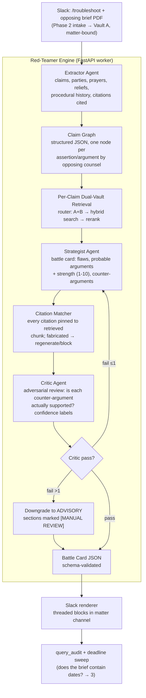

# RedCase — Phase 3 Technical Design Document
## Red-Teamer Engine · Statutory Deadline Tracker · RAG Precision Tuning · Go-Live

**Version:** 1.0 | **Status:** Ready for implementation
**Builds on:** Phase 1 (Vault B + RAG core), Phase 2 (Vault A + Slack Hub + dual-vault router)
**Design authority:** project master prompt (`master-prompt.md`)

---

## 0. Scope & One Deliberate Design Deviation

Phase 3 delivers the two highest-value workflow modules and the quality/safety infrastructure to go live.

**Deviation flagged:** Phases 1–2 used hard refusal below similarity thresholds (`"No binding precedent found in Vault B."`). Phase 3's prompt asks for a **labeled fallback** (`"Low confidence context—manual review recommended"`). These serve different functions: refusal is correct for *research answers* (wrong answer = malpractice risk), labeling is correct for *adversarial analysis* (a battle card is inherently advisory, and a partner would rather see a flagged weak signal than silence). The engine therefore supports **three modes**:

| Mode | Threshold behavior | Used by |
|---|---|---|
| `STRICT` | Refuse below threshold | Vault Search, `/find-precedent` |
| `ADVISORY` | Label low-confidence sections, continue | Red-Teamer battle cards |
| `HYBRID` | Refuse on legal propositions, label on strategic analysis | Cross-vault synthesis |

---

## 1. Workflow Module Architecture & Agentic Flow

### 1.1 Red-Teamer execution loop



### 1.2 Battle card schema (the contract every agent stage produces/consumes)

```json
{
  "matter_id": "uuid",
  "source_document_id": "uuid",
  "generated_at": "2026-09-16T02:30:00Z",
  "sections": {
    "procedural_flaws": [
      {"flaw": "...", "basis": "...", "authority": ["B:doc_uuid"],
       "severity": "HIGH|MED|LOW", "confidence": 0.0}
    ],
    "opposing_arguments": [
      {"argument": "...", "strength": 7, "our_counter": "...",
       "authority": ["B:doc_uuid", "A:doc_uuid"],
       "confidence": 0.0, "manual_review": false}
    ],
    "jurisdictional_notes": ["..."]
  },
  "critic_verdict": {"pass": true, "regenerations": 0, "downgraded_sections": []}
}
```

---

## 2. Legal Red-Teamer Engine

### 2.1 Agent chain (`app/redteam/engine.py`)

```python
import json
from dataclasses import dataclass

from app.middleware.zdr import zdr_client
from app.router.service import dual_vault_query     # Phase 2
from app.retrieval.rerank import rerank             # 4
from app.redteam.schemas import BattleCard, ClaimGraph
from app.redteam.render import render_battle_card   # Slack blocks

SONNET = "claude-3-5-sonnet-20241022"
MAX_REGENERATIONS = 1

EXTRACTOR = """You are the RedCase Extractor. Analyze this opposing filing and
extract a claim graph. JSON only:
{"parties": {"claimant": "...", "defendant": "..."},
 "prayers": ["..."],
 "procedural_history": ["..."],
 "claims": [{"id": "c1", "type": "FACTUAL|LEGAL|PROCEDURAL",
             "text": "...", "cited_authorities": ["..."],
             "relief_sought": "..."}],
 "notable_dates": ["2024-03-12: hearing"], "document_type": "BRIEF|MOTION|AFFIDAVIT"}
Rules: extract ONLY what the document states. No inference."""

STRATEGIST = """You are a senior Nigerian litigation strategist (RedCase Strategist).
Given the opposing claim graph and retrieved context, produce a battle card.
For each procedural/jurisdictional flaw cite the specific rule/statute from context.
For each opposing argument: strength 1-10 (10 = near-fatal to us), our counter-argument,
and authority UUIDs drawn ONLY from <context_uuids>. Confidence = your certainty the
authority actually supports the counter. JSON per the battle-card schema."""

MATCHER = """You are the Citation Matcher. For each authority UUID cited in the
battle card, verify: (a) UUID exists in <context_uuids>, (b) the cited proposition
is actually supported by that passage's text. Output JSON:
{"valid": [{"uuid": "...", "supports": "..."}],
 "invalid": [{"uuid": "...", "reason": "..."}]}  — invalid citations are dropped."""

CRITIC = """You are the RedCase Legal Critic — an adversarial reviewer. Your job is
to KILL weak analysis before a partner sees it. Check:
1. Every counter-argument is logically responsive to the specific claim.
2. Every authority citation supports what it's cited for (cross-check passage text).
3. No argument relies on facts not in the claim graph or retrieved context.
4. Strength ratings are calibrated (7+ requires binding SC/CA authority).
Output JSON: {"pass": true|false, "section_feedback": {"procedural_flaws": "...",
"opposing_arguments": "..."}, "downgrade": ["section_ids"]}"""

async def redteam(document_id: str, ident, db) -> BattleCard:
    text = await load_decrypted_text(document_id, ident)      # Phase 2 envelope decrypt
    client = zdr_client.anthropic()

    claims: ClaimGraph = await run_agent(client, EXTRACTOR, text,
                                         schema=ClaimGraph)

    # Per-claim retrieval, batched: one dual-vault query per legal claim,
    # procedural claims get a single combined query (they share authority sets)
    legal = [c for c in claims.claims if c.type == "LEGAL"]
    proc  = [c for c in claims.claims if c.type == "PROCEDURAL"]
    contexts, uuids = {}, set()
    queries = [c.text for c in legal] + [" ".join(c.text for c in proc)]
    results = await asyncio.gather(*[
        dual_vault_query(q, ident, db, mode="ADVISORY") for q in queries])
    for claim, r in zip(legal + [None], results):
        ctx = rerank(r["passages"], claim.text if claim else queries[-1], top_k=8)
        contexts[claim.id if claim else "_proc"] = ctx
        uuids |= {p["document_id"] for p in ctx}

    card = None
    for attempt in range(MAX_REGENERATIONS + 1):
        card = await run_agent(client, STRATEGIST,
                               payload={"claims": claims.model_dump(),
                                        "contexts": dump(contexts),
                                        "context_uuids": sorted(uuids)},
                               schema=BattleCard)
        match = await run_agent(client, MATCHER,
                                payload={"card": card.model_dump(),
                                         "context_uuids": sorted(uuids),
                                         "passages": dump(contexts)})
        card = drop_invalid_citations(card, match)

        verdict = await run_agent(client, CRITIC,
                                  payload={"card": card.model_dump(),
                                           "claims": claims.model_dump(),
                                           "passages": dump(contexts)})
        if verdict["pass"]:
            card.critic_verdict = {"pass": True, "regenerations": attempt,
                                   "downgraded_sections": []}
            break
        if attempt == MAX_REGENERATIONS:
            card = downgrade_sections(card, verdict["downgrade"])
            card.critic_verdict = {"pass": False, "regenerations": attempt,
                                   "downgraded_sections": verdict["downgrade"]}
        # else: regenerate with critic feedback injected

    await audit_redteam(document_id, ident, card)             # query_audit extension
    await sweep_dates_for_deadlines(claims, ident, db)        # 3 hook
    return card
```

### 2.2 Slack rendering

`render_battle_card` emits threaded blocks: collapsible sections per opposing argument (Slack `rich_text` + `context` blocks), strength as a 1–10 meter (▰▰▰▰▰▰▱▱▱▱), authority chips linking source PDFs, `[MANUAL REVIEW]` badge on downgraded sections, and a footer: `ADVISORY ANALYSIS · NOT LEGAL ADVICE · Verify citations before filing` — the AI-disclosure requirement from the master prompt, enforced in the renderer so no code path can omit it.

---

## 3. Statutory Deadline & Calendar Tracker

### 3.1 Rule-pack design (no invented law)

Deadline computation is **data-driven, not code-driven**. Nigerian court rules vary by court and by state limitation law; hardcoding invites error and violates the master prompt's no-invented-law rule. Deadlines are rows in a versioned rule pack maintained and validated by qualified lawyers:

```sql
CREATE TABLE deadline_rules (
    id           UUID PRIMARY KEY DEFAULT gen_random_uuid(),
    jurisdiction TEXT NOT NULL DEFAULT 'NG',
    court_level  TEXT NOT NULL,
    rule_name    TEXT NOT NULL,              -- 'interlocutory_appeal_period'
    trigger_event TEXT NOT NULL,             -- 'order_delivered' | 'judgment_delivered' | 'date_in_document'
    offset_days  INT NOT NULL,
    computation  TEXT NOT NULL DEFAULT 'CALENDAR'  -- or 'BUSINESS' (court days)
                 CHECK (computation IN ('CALENDAR','BUSINESS')),
    source_ref   TEXT NOT NULL,              -- statute/rule citation for validation
    validated_by TEXT, validated_at TIMESTAMPTZ,
    valid_from   DATE, valid_to DATE
);

CREATE TABLE deadline_events (
    id           UUID PRIMARY KEY DEFAULT gen_random_uuid(),
    tenant_id    UUID NOT NULL REFERENCES tenants(id),
    matter_id    UUID NOT NULL REFERENCES matters(id),
    source_document_id UUID REFERENCES documents(id),
    rule_id      UUID REFERENCES deadline_rules(id),
    event_type   TEXT NOT NULL,              -- 'FILING_DEADLINE' | 'HEARING' | 'LIMITATION'
    description  TEXT NOT NULL,
    trigger_date DATE,                       -- when clock starts (if known)
    due_date     DATE NOT NULL,
    confidence   NUMERIC(3,2),
    status       TEXT NOT NULL DEFAULT 'PENDING'
                 CHECK (status IN ('PENDING','NOTIFIED','DISMISSED','MISSED')),
    assigned_to  TEXT,
    created_at   TIMESTAMPTZ DEFAULT now()
);
```

> **Seeding example (MUST be validated by Nigerian counsel before go-live):** interlocutory appeal → 14 days; judicial review → 3 months (Lagos/FRHC practice varies); statute of limitations → state-specific (e.g., actions in contract commonly 6 years under state Limitation Laws). The rows ship with `validated_by = NULL` and the UI surfaces "⚠ unvalidated rule" until a partner confirms them.

### 3.2 Detection engine (regex + function calling)

```python
# app/deadlines/engine.py
DATE_PATTERNS = [
    r"\b(\d{1,2})(?:st|nd|rd|th)?\s+(January|February|...|December),?\s+(\d{4})\b",
    r"\b(\d{1,2})/(\d{1,2})/(\d{2,4})\b",
    r"\b(\d{4})-(\d{2})-(\d{2})\b",
]
TRIGGER_WORDS = re.compile(
    r"(order|judgment|ruling|decree|writ|affidavit|hearing|originating process|"
    r"appeal|judicial review|pre-action notice)", re.I)

EXTRACT_TOOLS = [{
    "name": "record_deadline_candidate",
    "description": "Record a legally significant date found in the document.",
    "input_schema": {"type": "object", "properties": {
        "event": {"type": "string", "enum": ["order_delivered","judgment_delivered",
                   "hearing","filing_date","other"]},
        "date": {"type": "string"}, "context_quote": {"type": "string"},
        "court_mentioned": {"type": "string"},
        "appears_appellate": {"type": "boolean"}}, "required": ["event","date","context_quote"]}}]

async def detect_deadlines(document_id: str, ident, db) -> list[dict]:
    text = await load_decrypted_text(document_id, ident)
    candidates = []
    if TRIGGER_WORDS.search(text):
        client = zdr_client.anthropic()
        msg = await client.messages.create(
            model=SONNET, max_tokens=1024,
            system="Scan this legal document for dates that start legal clocks "
                   "(orders, judgments, hearings, filing dates). Call "
                   "record_deadline_candidate for each. Extract ONLY stated dates.",
            tools=EXTRACT_TOOLS, tool_choice={"type": "any"},
            messages=[{"role": "user", "content": text[:12000]}])
        candidates = [json.loads(b.input) for b in msg.content
                      if b.type == "tool_use"]

    rules = await load_validated_rules(ident.tenant_id)
    events = []
    for c in candidates:
        for rule in match_rules(c, rules):            # e.g., order_delivered + appellate court → 14d
            due = compute_deadline(c["date"], rule)   # calendar vs business days
            events.append(await insert_deadline_event(
                tenant_id=ident.tenant_id, matter_id=ident.matter_id,
                source_document_id=document_id, rule_id=rule.id,
                event_type="FILING_DEADLINE" if rule.offset_days else "HEARING",
                description=f"{rule.rule_name}: {c['context_quote'][:120]}",
                trigger_date=parse_date(c["date"]), due_date=due,
                confidence=0.85 if rule.validated_by else 0.5,
                assigned_to=ident.user_ref))
    return events
```

### 3.3 Notification fan-out (Slack + Google/Outlook)

```python
# app/deadlines/notify.py
async def notify_deadline(event, matter, db):
    channel = matter.slack_channel
    await slack_client.chat_postMessage(channel=channel,
        blocks=[{"type": "header", "text": {"type": "plain_text",
                 "text": f"⏰ Deadline: {event.due_date:%d %b %Y}"}},
                {"type": "section", "text": {"type": "mrkdwn",
                 "text": f"*{event.description}*\n"
                          f"Rule: `{rule.rule_name}` ({rule.source_ref})\n"
                          f"Confidence: {'✅ validated' if rule.validated_by else '⚠ unvalidated rule'}"}}])

    gcal = GoogleCalendarClient(await oauth_token(matter.tenant_id, "google"))
    await gcal.events.insert(calendarId="primary", body={
        "summary": f"[{matter.matter_ref}] {event.description[:80]}",
        "start": {"date": str(event.due_date)},
        "end": {"date": str(event.due_date + timedelta(days=1))},
        "reminders": {"useDefault": False,
                      "overrides": [{"method": "popup", "minutesBefore": 9*60},
                                    {"method": "email", "minutesBefore": 7*24*60}]}})
    # Outlook/Microsoft Graph: identical body shape via /me/events

async def daily_sweep(db):
    """07:00 Africa/Lagos cron: notify on T-14, T-7, T-2, T-0."""
    for ev in await due_soon(db, days=(14, 7, 2, 0)):
        if not already_notified(ev):
            await notify_deadline(ev, ev.matter, db)
```

The daily sweep is an idempotent Cloud Scheduler → FastAPI job; notification state lives in `deadline_events.status` + a `deadline_notifications` child table so retries never double-post.

---

## 4. RAG Precision Tuning & Reranking Pipeline

### 4.1 Reranker abstraction

```python
# app/retrieval/rerank.py
from enum import Enum

class Reranker(str, Enum):
    COHERE = "cohere"          # managed API, zero infra, ZDR-compatible tier
    BGE_LOCAL = "bge_local"    # BAAI/bge-reranker-v2-m3 on CPU GPU worker, no external calls

class RerankService:
    def __init__(self, backend: Reranker = settings.RERANKER):
        self.backend = backend
        if backend == Reranker.COHERE:
            import cohere
            self.client = cohere.AsyncClient(settings.COHERE_API_KEY)
        else:
            from sentence_transformers import CrossEncoder
            self.model = CrossEncoder("BAAI/bge-reranker-v2-m3")

    async def rerank(self, query: str, passages: list[dict],
                     top_k: int = 8) -> list[dict]:
        if self.backend == Reranker.COHERE:
            r = await self.client.rerank(model="rerank-multilingual-v3.0",
                                         query=query,
                                         documents=[p["text"] for p in passages],
                                         top_n=top_k)
            out = [{**passages[i.index], "rerank_score": i.relevance_score}
                   for i in r.results]
        else:
            scores = self.model.predict([(query, p["text"]) for p in passages])
            ranked = sorted(zip(passages, scores), key=lambda t: -t[1])[:top_k]
            out = [{**p, "rerank_score": float(s)} for p, s in ranked]
        return out
```

**Placement:** reranking runs **after** hybrid retrieval (top-20) and **before** the LLM, and also per-claim inside the Red-Teamer (2.1). It never replaces the vector threshold gate — it reorders and prunes what already passed.

### 4.2 Dual-threshold enforcement

```python
# app/retrieval/gates.py
VECTOR_GATE   = 0.78     # Phase 1: hard floor to enter the candidate set
RERANK_GATE   = 0.75     # Phase 3: post-rerank floor for "usable" context
ADVISORY_FLOOR = 0.60    # below this, context is discarded entirely

def apply_gate(passages: list[dict], mode: Mode) -> tuple[list[dict], str]:
    usable = [p for p in passages if p["rerank_score"] >= RERANK_GATE]
    dropped = [p for p in passages if ADVISORY_FLOOR <= p["rerank_score"] < RERANK_GATE]

    if mode == Mode.STRICT and (not usable or max(p["rerank_score"] for p in usable) < 0.85):
        return [], "REFUSAL"
    if mode == Mode.ADVISORY and dropped:
        return usable, "LOW_CONFIDENCE"      # sections carry [MANUAL REVIEW] label
    return usable, "OK"
```

Threshold calibration is a **go-live gate**, not a guess: 5 runs the 5-case benchmark and produces the score-distribution plot; thresholds are set at the precision ≥ 0.95 crossover and committed to config, with the calibration report attached to the PAT sign-off.

---

## 5. Deployment, Partner Acceptance Testing (PAT) & Go-Live

### 5.1 14-day go-live roadmap

| Days | Workstream | Exit criterion |
|---|---|---|
| 1–2 | Reranker deployed (BGE local worker on Fargate); thresholds wired to `Mode` gates | Unit tests pass; latency budget: rerank adds <400ms p95 |
| 3–5 | Red-Teamer engine + Slack renderer in staging; Critic loop hardened | 3 seeded briefs produce cards; 0 fabricated citations in matcher output |
| 6–8 | Deadline engine: rule pack seeded (counsel-validated rows only), detection + calendar fan-out staging | Synthetic order PDF → correct due date in Slack + Google Calendar + Outlook |
| 9–11 | **Benchmark: 5 real firm cases** (concluded matters, partner-selected) | Metrics below hit; calibration report signed |
| 12 | Partner training (90 min): battle card reading, deadline workflow, `#knowledge-admin` curation | All 3 partners complete hands-on session |
| 13 | Monitoring cutover; rollback drill | Alert fires in <2 min on staged failure; rollback restores in <15 min |
| 14 | **Go-live** on live corpus; hypercare week begins | Partners use production for real matters |

### 5.2 Benchmark acceptance criteria (the PAT gate)

| Metric | Target | Method |
|---|---|---|
| Citation fabrication rate | **0 / 100 generated citations** | Critic + Matcher logs, sampled by partner |
| Red-teamer flaw recall | ≥80% of flaws partners independently listed | 5 concluded cases with known outcomes |
| Deadline extraction precision | ≥90% dates, 0 false due-dates from validated rules | Synthetic + real document set |
| Vault A privilege isolation | 0 unauthorized retrievals (pen test) | Adversarial query battery vs. RLS |
| End-to-end latency | p95 < 30s battle card; p95 < 8s research query | Grafana dashboards |
| Refusal correctness | 100% of out-of-corpus questions refused/labeled | Adversarial question set |

### 5.3 Monitoring & observability

- **Infra:** Prometheus + Grafana — FastAPI request rate/latency, worker queue depth, pgvector index health, KMS decrypt failures (a spike = privilege attack signal).
- **LLM/prompt observability:** **Langfuse** (self-hosted, EU region — keeps telemetry out of third-party SaaS; satisfies the same ZDR discipline as the corpus: prompt traces retained 14 days, redacted, then purged). Dashboards: tokens/query, route distribution, threshold-gate pass rates, Critic regeneration rate (a rising rate = retrieval degradation, alert at >15%).
- **Alerting:** PagerDuty/Slack `#ops-alerts` — fabrications (any), critic loop failures, deadline sweep misses, audit-log write failures. Audit write failure is a **page-level** event: the system halts LLM responses rather than run unaudited.

### 5.4 Go-live checklist

- [ ] Threshold calibration report signed by all 3 partners
- [ ] Deadline rule pack: every active row has `validated_by` set; unvalidated rows disabled in prod
- [ ] ZDR re-verification on new model paths (Critic, Extractor, deadline scanner)
- [ ] Slack OAuth scopes re-audited; guest access tested end-to-end
- [ ] Rollback: previous deployment tag verified restorable in <15 min
- [ ] NDPA artifacts current: RoPA (Vault A + Slack + calendar processors), DPIA for deadline engine, DPA with calendar providers
- [ ] Runbook delivered: incident response, threshold recalibration procedure, rule-pack update workflow
- [ ] Partner sign-off recorded in `#ai-audit`

---

## 6. Consolidated Platform State After Phase 3

```
RedCase v1.0 (Aetoes tenant)
├── Vault B: Juris OS — public Nigerian jurisprudence, grounded retrieval
├── Vault A: Firm Brain — encrypted, ACL'd, matter-scoped
├── Dual-vault router — intent classification, cross-vault synthesis
├── Red-Teamer — 4-agent chain, Critic-validated battle cards (ADVISORY)
├── Deadline Tracker — counsel-validated rule pack, Slack + calendar fan-out
├── Slack Ops Hub — @LegalBrain, /troubleshoot, intake, #ai-audit
└── ZDR + immutable audit — enforced at DB and middleware layers
```

Post-v1 roadmap hooks (per master prompt Phases 3–4): client portal replacing Slack guests, billing/timekeeping on the `clients`/`matters` spine, Qdrant migration for corpus scale, additional jurisdiction packs.

*Document version 1.0 — RedCase Phase 3. Design authority: project master prompt (`master-prompt.md`).*
